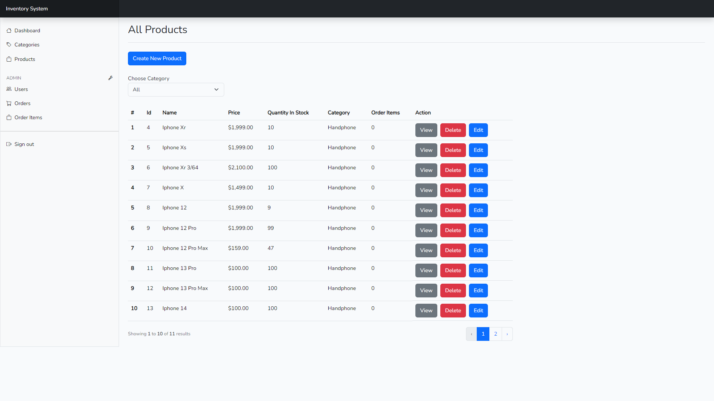

# Inventory System: Laravel 10, Bootstrap 5.3, MySQL, Blade Template, Eloquent

This is my first project after I have been learning Laravel for approximately 3-4 weeks.
And I tried to apply all the things I learned, to create a simple Inventory System, even though it is not API based, but I am quite proud, because I succeeded in designing the System from scratch.
And in the future, if I learn enough things about the Laravel API, I will try to implement it in the API version.

I updated this readme.md on 10/02/2024, the api version has been released, you can visit the repository below:
- https://github.com/weiwei2694/laravel10-restful-api-inventory-system




## Key Features

- Roles System
- Categories
- Products
- Orders
- Order Items
- Users
- Crud
- Responsive Web
- Synchronous Data Between Orders, Order Items and Products
- MYSQL
- Blade Template
- Unit Testing
- Authentication
- Authorization
- Route Management
- Pagination
- Eloquent

## Cloning the repository

```bash
git clone https://github.com/weiwei2694/laravel10-inventory-system.git
cd laravel10-inventory-system
```

## Install packages

*package*
```bash
npm install
yarn install
pnpm install
bun install
```

*composer*
```bash
composer install
composer update
```

## Setup .env file
For setting up your environment variables, you can start by copying the `.env.example` file to create your `.env` file. The `.env.example` file typically contains examples or placeholders for the environment variables your application needs. To simplify this process, you can use the following command:
```bash
cp .env.example .env
```
This command will duplicate the `.env.example` file and create a new file named `.env`, allowing you to fill in the actual values for your environment variables.

After creating your `.env` file, ensure that your Laravel application is ready to run smoothly by executing the following command to generate an application key:
```bash
php artisan key:generate
```
This command will generate a unique key for your application, which is essential for security and encryption purposes.

Next, make sure that the database configuration in your .env file points to your MySQL database. Update the `DB_DATABASE`, `DB_USERNAME`, and `DB_PASSWORD` variables with the appropriate values for your MySQL database setup.

To prepare for running unit tests, you should create a separate `.env` file specifically for testing purposes. Copy the contents of your .env file and create a new file named `.env.testing.` In the `.env.testing` file, modify the `DB_DATABASE` variable to a testing database name of your choice, such as `mysql_testing`. This ensures that your unit tests run independently from your main database, preventing any data loss or interference with your production data.

Ensure that both your `.env` and `.env.testing` files are properly configured before proceeding with running your Laravel application or executing unit tests.

## Running Applications

To start your application, make sure to follow the steps below:

1. **Styling with Bootstrap**: Before running the application, ensure you have prepared the styling using Bootstrap. Run the following command to compile your assets:
   ```bash
   npm run dev
   ```
   This will ensure that the user interface of your application is styled properly using Bootstrap.
   
2. **Starting the Server**: After ensuring the styling has been applied, you can start the Laravel PHP server by running the command:
   ```bash
   php artisan serve
   ```
   Make sure to run the command in a separate terminal. This will start your local development server and make your application accessible through your web browser.

By following these steps, you can start running your application and access it through your web browser for further development. Happy exploring and developing your application!
